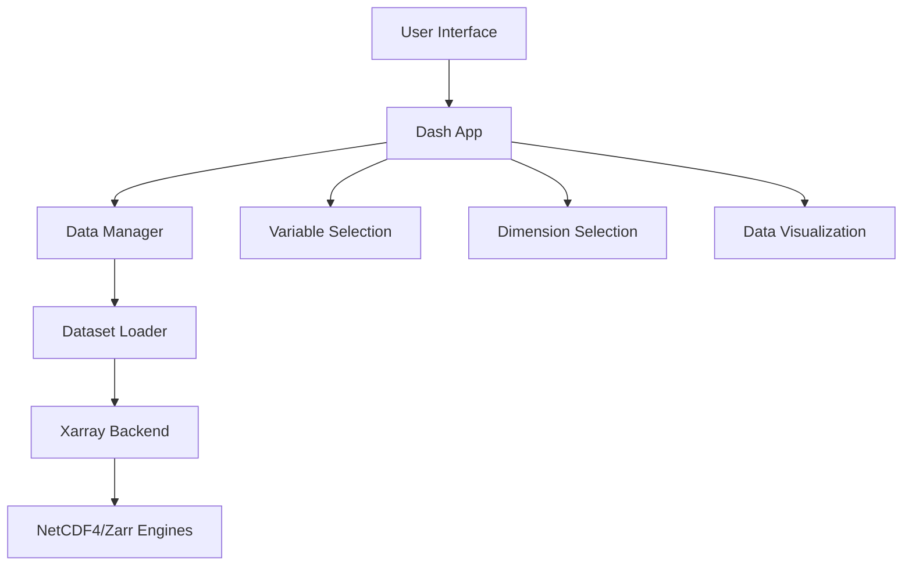

# 🌊 Dash NCZarr Viewer

## A Tool for R Users to Explore Ocean Data

**Samuel Fooks** - VLIZ  
**Making NetCDF/Zarr Data Accessible to Everyone**

---

# 🎯 What is Dash NCZarr Viewer?

A **web-based application** that helps R users and beginners:

- 📊 **Load and explore** NetCDF and Zarr datasets without coding
- 🔍 **Browse variables** and dimensions through a simple interface
- ✂️ **Subset data** by time, space, and other dimensions visually
- 📈 **Visualize results** with interactive plots (no ggplot2 needed!)
- 🌍 **Access cloud data** directly from S3 buckets
- 🚀 **Work with large datasets** efficiently
- 🐳 **Containerized** for easy deployment and sharing

---

# 🏗️ Architecture Overview



**Built with modern Python data science stack**

---

# 🛠️ Technology Stack

- **Frontend**: Dash + Bootstrap Components (similar to R Shiny!)
- **Data Processing**: Xarray + NumPy (Python equivalent of R's ncdf4, raster)
- **File Formats**: NetCDF4, Zarr (same formats R can read)
- **Visualization**: Plotly, Matplotlib, Cartopy (interactive plots like R's leaflet)
- **Cloud Access**: S3FS, FSSpec (cloud storage access)
- **Marine Data**: Copernicus Marine Toolbox integration

---

# 🚀 Quick Start

## For R Users - No Python Required!

```bash
# Option 1: Use Docker (Recommended for beginners)
docker run -p 8050:8050 samfooks/zarr-netcdf-viewer:latest

# Option 2: Local development (if you have Python)
git clone https://github.com/samuelfooks/dash_nczarr_viewer
cd dash_nczarr_viewer
pip install -r requirements.txt
python run.py
```

**Access at**: http://localhost:8050

**💡 Tip**: Think of this as "R Shiny for NetCDF data" - but already built for you!

---

# 📁 Supported Data Sources

- **Local Files**: NetCDF, Zarr
- **Personal Cloud Storage**: [Minio storage](https://datalab.dive.edito.eu/file-explorer) on EDITO
- **Marine Data**: Copernicus Marine Service (CMEMS)
- **EDITO Integration**: STAC catalogs and ARCO data

---

# 🔍 Core Features

## Data Exploration
- **Variable Browser**: See all variables, dimensions, and metadata
- **Dimension Handling**: Time, depth, latitude, longitude
- **Data Subsetting**: Interactive selection of regions and time periods

## Visualization
- **Interactive Maps**: Cartopy-based geographic plots
- **Time Series**: Plotly charts for temporal data
- **Statistical Analysis**: Basic stats, trends, and summaries

---

# 🌊 Marine Data Examples

## EDITO Integration
- **Biodiversity**: Species distribution data
- **Chemistry**: Water quality parameters
- **Geology**: Seafloor characteristics
- **STAC Access**: Browse collections and datasets

## Copernicus Marine
- **Direct Access**: CMEMS credentials integration
- **Multiple Formats**: NetCDF, Zarr, GRIB support
- **Real-time Data**: Latest ocean observations

---

# 🚀 Performance Features

- **Chunked Processing**: Handle datasets larger than memory
- **Lazy Loading**: Only load data when needed
- **Caching**: Store frequently accessed data
- **Parallel Processing**: Multi-core data operations
- **Cloud Optimization**: Efficient S3 data access

---

# 🔧 Configuration & Deployment

## Setup
To access CMEMS datasets you may need an account using [Copernicus Marine Toolbox](https://help.marine.copernicus.eu/en/articles/7949409-copernicus-marine-toolbox-introduction#h_9172b5c79a)
```bash
# CMEMS credentials
CMEMS_USERNAME=your_username
CMEMS_PASSWORD=your_password
```

## Docker Deployment
```bash
docker build -t nczarr-viewer .
docker run -p 8050:8050 nczarr-viewer
```

---

# 📊 Use Cases

## For Beginners
- **Data Exploration**: Understand dataset structure
- **Quick Visualizations**: Create plots without coding
- **Data Subsetting**: Extract regions of interest

## For Advanced Users
- **Data Validation**: Check data quality and coverage
- **Preprocessing**: Prepare data for analysis
- **Integration**: Embed in larger workflows

---

# 🔮 Future Development

- **R Integration**: Direct R package support
- **Advanced Analytics**: Statistical modeling tools
- **Collaboration**: Multi-user editing and sharing
- **Mobile Support**: Responsive design for tablets
- **API Access**: REST endpoints for automation

---

# 🎯 Key Takeaways

1. **Accessible**: No coding required for basic operations
2. **Powerful**: Handles large datasets efficiently
3. **Flexible**: Works with multiple data sources
4. **Containerized**: Easy deployment and sharing
5. **R-Friendly**: Familiar interface for R users

---

# 🌊 Live Demo Time!

## Let's Explore Some Real Data!

**3-5 minutes to show:**
- Loading a dataset
- Browsing variables
- Subsetting data
- Creating visualizations
- Exporting results

**Questions & Discussion**

---

# 🌊 Thank You!

**Samuel Fooks** - samuel.fooks@gmail.com  
**GitHub**: https://github.com/samuelfooks/dash_nczarr_viewer  
**Docker Hub**: samfooks/zarr-netcdf-viewer

**Questions?**
